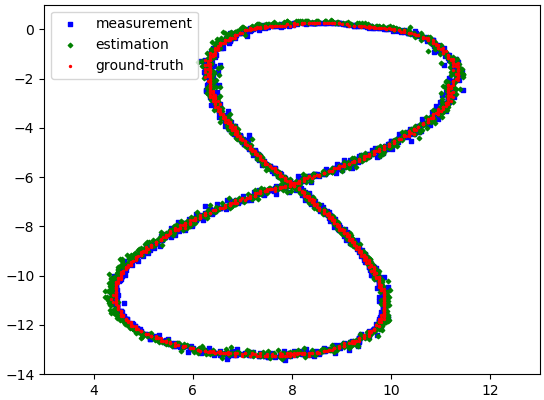
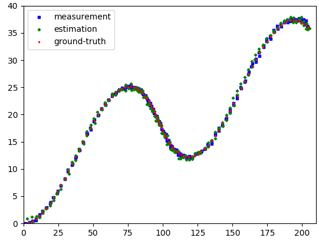
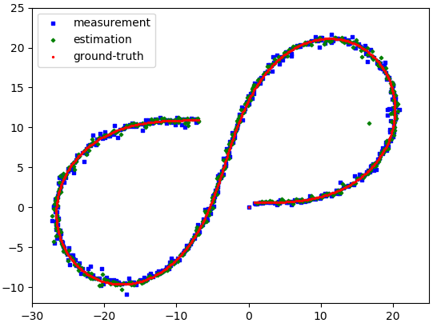

# Extended and Unscented Kalman Filters

This project is based on the [chapter of sensor fusion](https://www.udacity.com/course/self-driving-car-engineer-nanodegree--nd013) of the Self-Driving Car Engineer Nanodegree from Udacity.
Even I didn't register for the course, I learned EKF & UKF from reading articles
 to this Nanodegree. Thanks Udacity for giving me this learning experience!

## Project Setting
Radar and Lidar measurements as well as ground-truth are stored in text files 
(in folder `data/`). Kalman Filters are used to fuse the measurements from two 
sensors and result in the estimations.

## Fusion Model

Lidar KF and Radar KF process the Lidar and Radar measurement, respectively.


To fuse the estimation, the state X and covariance matrix P are shared between 
two filters. It is also possible to share the process uncertainty Q in addition 
to X and P.

## System Model
I simply use a constant acceleration model for the KFs.
```
[x1 ]   [1 T 0 0]   [x ]
[vx1] = [0 1 0 0] * [vx]
[y1 ]   [0 0 1 T]   [y ]
[vy1]   [0 0 0 1]   [vy]
```
But any other model that supports the interface in `\include\model\model.h` can be used.

## Linear KF

It is possible to use only linear KFs for fusing the measurements. In that case,
the state X = [x, y, vx, vy] and the measurement for both sensor z = [x, y].

For it, just extract the position measurement from each sensor. But to make use
of velocity measurement from Radar, EKF and UKF should be used because a 
non-linearity now presents.

## Extended KF

I use a linear KF for processing the Lidar measurement and EKF for 
Radar. That means,
X = [x, y, vx, vy], z_lidar = [x, y] and z_radar = [rho, phi, rho_dot]

| 1.txt | 2.txt | 3.txt |
| --- | --- | --- |
|  |  | |

## Unscented KF [still incomplete fusion]

Each UKF looks plausible without fusion. Each UKF performs similarly well to each
corresponding EKF without fusion.

|          | 1.txt | 2.txt | 3.txt |
| ---      | ---- | --- | --- |
| LidarUKF |  |  | |
| RadarUKF |  |  | |

But when I fuse Lidar UKF with Radar UKF using the fusion model above. The 
system fails and the estimation diverges. This problem is still unsolved for me.

In my opinion, the reason is that UKF demands more accurate model than EKF, while
the current constant acceleration model is not sufficiently good (this is indicated
by a large tuned process uncertainty matrix Q). This model doesn't have any 
knowledge of the vehicle dynamics (i.e. the car is considered as a single moving point). 
This problem of UKf is also adressed in this 
[paper](https://www.semanticscholar.org/paper/A-Robust-Adaptive-Unscented-Kalman-Filter-for-with-Zheng-Fu/d89165e037fd75bb24ef7a442ead7ec23b312460)
Unfortunately, I don't have dynamics infomation of the vehicle in the data 
to construct a better model.

## Basic Build Instructions
1. Clone this repo.
2. Make a build directory: `mkdir build && cd build`
3. Compile: `cmake .. && make`
4. Run it: `./kalman_filters_cpp`
 

