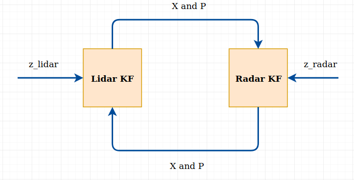
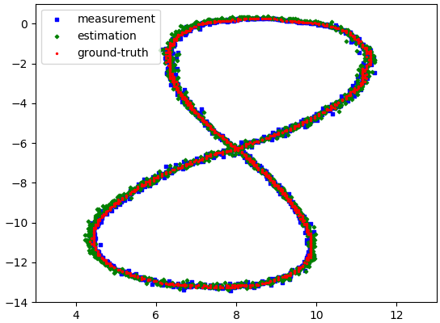
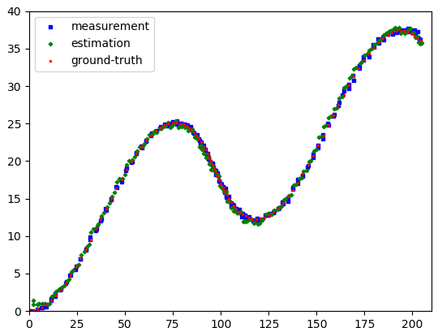
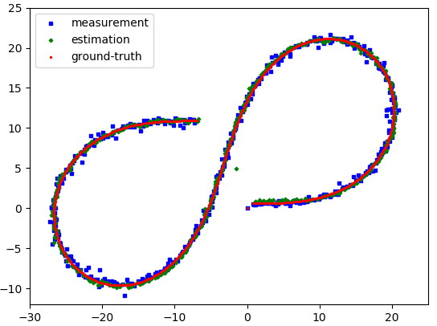

# Extended and Unscented Kalman Filters

This project is based on the [Sensor Fusion section](https://www.udacity.com/course/self-driving-car-engineer-nanodegree--nd013) of the Self-Driving Car Engineer Nanodegree from Udacity.
Even I didn't register for the course, I learned EKF & UKF from reading articles to this Nanodegree. Thanks Udacity for giving me this learning experience!

## Project Setting
Radar and Lidar measurements as well as ground-truth are stored in text files (in ./data). Kalman Filters are used to fuse the measurements from two sensor and result in the estimations.

## Fusion Model

The state X and covariance matrix P are shared between two filters. It is also possible to share the process uncertainty Q in addition to X and P.

## Linear KF

It is possible to use linear KF only for fusing the measurements. Both Lidar and Radar measures directly the position. In this case,
the state X = [x, y, vx, vy] and the measurement for both sensor z = [x, y].

## Extended KF

I use a linear KF for processing the Lidar position measurement. That means,
X = [x, y, vx, vy] and z = [x, y]
I use an EKF for processing the Radar position measurement. That means,
X = [x, y, vx, vy] and z = [rho, phi, rho_dot]

| 1.txt | 2.txt | 3.txt |
| --- | --- | --- |
|  |  | |

The images above show the result. I haven't tune the uncertainty matrices yet. P, Q and R are simply identity matrices.

## Unscented KF
 

