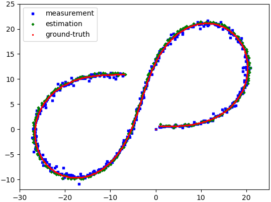

# Extended and Unscented Kalman Filters

This project implement extended and extended kalman filters. The test data comes from
[chapter of sensor fusion](https://www.udacity.com/course/self-driving-car-engineer-nanodegree--nd013) 
of the Self-Driving Car Engineer Nanodegree from Udacity.

## Basic Setup & Build Instructions

### Setup
1. Clone this project `git clone https://github.com/huuanhhuynguyen/kalman_filters.git`
2. Clone matplotlib-cpp library `git clone https://github.com/lava/matplotlib-cpp.git`
3. Install dependencies `sudo apt-get install python-matplotlib python-numpy`

Note: See https://github.com/lava/matplotlib-cpp for further instructions on installation of matplotlib-cpp.

### Build
1. Make a build directory: `mkdir build && cd build`
2. Compile: `cmake .. && make`
3. Run it: `./kalman_filters_cpp` will show the result of EKF fusion on one data example.

Change the following lines in `src/main.cpp` to run with another data example 
or with UKF:
```
// App Configuration
Data data = Data::THREE;  // or Data::ONE, Data::TWO
FilterType type = FilterType::EXTENDED;  // or FilterType::UNSCENTED
```

## Further Explanation

### Project Setting

Radar and Lidar measurements as well as ground-truth data are stored as text files 
in the project folder `data/`). To fuse the measurements in to final estimations,
(Extended / Unscented) Kalman Filters are used.

### Progress

- [x] EKF runs separately on Lidar or Radar measurement
- [x] Fusion of two EKFs
- [x] UKF runs separately on Lidar or Radar measurement
- [ ] Fusion of two UKFs

### Fusion Model

Lidar KF and Radar KF process the Lidar and Radar measurement, respectively.


To fuse the estimation, the state X and covariance matrix P are shared between 
two filters. It is also possible to share the process uncertainty Q in addition 
to X and P.

<details><summary> Further details </summary>
<p>
### System Model

I simply use a constant acceleration model for the KFs.
```
[x1 ]   [1 T 0 0]   [x ]
[vx1] = [0 1 0 0] * [vx]
[y1 ]   [0 0 1 T]   [y ]
[vy1]   [0 0 0 1]   [vy]
```
But any other model that supports the interface in `\include\model\model.h` can be used.

### Linear KF

It is possible to use only linear KFs for fusing the measurements. In that case,
the state X = [x, y, vx, vy] and the measurement for both sensor z = [x, y].

For it, just extract the position measurement from each sensor.

### Extended KF

To make use of velocity measurement from Radar, an EKF is needed because the 
measurement equation of Radar is non-linear:
```
rho = x*x + y*y
phi = atan2(y, x)
phi_dot = (x*vx + y*vy) / (x*x + y*y)
```

A linear KF is still used for processing Lidar. Indeed, linear KF is a special case
of EKF where the process and measurement functions `f(X)` and `h(X)` are linear.

Result:

| 1.txt | 2.txt | 3.txt |
| --- | --- | --- |
|  |  | |

### Unscented KF

Without fusion, each UKF performs similarly as each EKF.

|          | 1.txt | 2.txt | 3.txt |
| ---      | ---- | --- | --- |
| LidarUKF |  |  | |
| RadarUKF |  |  | |

However, when I fuse Lidar UKF with Radar UKF using the fusion model above. The 
system fails and the estimation diverges. This problem is **still unsolved**.

In my opinion, the reason is that UKF demands a more accurate model than EKF, while
the current constant acceleration model is not sufficiently good (this is indicated
by a relatively large process uncertainty matrix Q). This model doesn't have any 
knowledge of the vehicle dynamics (i.e. the car is considered as a single moving point). 
Unfortunately, I don't have the dynamics infomation of the vehicle in the data 
to construct a better model.

The problem of UKF is also addressed
[here](https://www.semanticscholar.org/paper/A-Robust-Adaptive-Unscented-Kalman-Filter-for-with-Zheng-Fu/d89165e037fd75bb24ef7a442ead7ec23b312460):
> Abstract: The Unscented Kalman filter (UKF) may suffer from performance degradation
> and even divergence while mismatch between the noise distribution assumed as a
> priori by users and the actual ones in a real nonlinear system.


</p>
</details>

 

